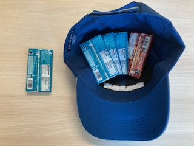

# Insurance and Risky Opportunities Discussion Questions

If you drew a blue gum out of the hat, it was a good year, if you drew a red gum, it was a bad year.

Think about what choices you made, and answer these questions.

 

## Key Point
Insurance can help make productive decisions less risky but it comes at a cost.

